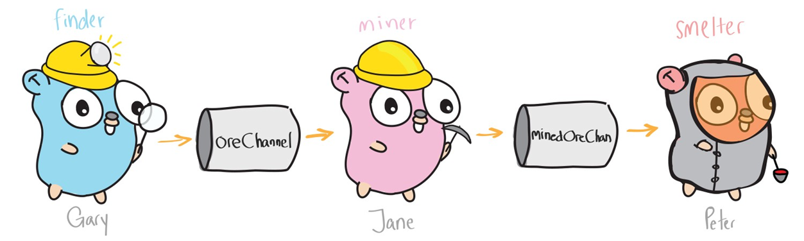

# 一次业务代码的流式重构



## 业务场景

目标 ~> 调度 ~> MQ ~> 引擎，就是生产者消费者模型，非常简单。

为了提高性能，调度需要将一个大目标拆分为多个子任务，启动多个引擎并发地去执行。

举个例子，用户输入一个 A 段目标 1.0.0.0/8（2^24=16,777,216），设置了全端口（1-65535）三种协议（ICMP UDP TCP）扫描，假定引擎每次处理 10W 目标，200 个端口时效率最佳。

## 老代码

``SpiltTargets`` ~> ``SpiltPorts`` ~> ``SpiltProtocol`` ~> ``MQ``，代码抽象为三个函数，顺序执行，每个阶段执行完才能进入下个阶段，中间产生的所有数据都保存在内存中，然后全部推送到 MQ。

``SpiltTargets`` 后，子任务数量变为 16,777,216 / 100,000 = 168

接着 ``SpiltPorts`` 后，65535 / 200 = 328，此时子任务数量变为 168 * 328 = 55104

最终 ``SpiltProtocol``，子任务数量 55104 * 2 + 168（ICMP 协议无端口）= 110376，高达 11W 之多

### 优点

- 代码实现简单
- 纯 CPU 运算，整个拆分过程快，由 MQ 持久化消息，不担心重启丢数据（不过不能在拆分的时候重启）

### 缺点

- 调度内存占用高（一行字符串最终变为 11W 行字符串）
- MQ 消息数量太多，内存占用大的同时，还可能丢消息

### 后续

其实按照 10W 目标，200 个端口拆分，整个系统还算撑得住，直到后来我们的系统把客户的路由器给打挂了（看来有时候不能一味的追求快）。

为了扫描变慢点，拆分粒度改为了 256 个目标，50 个端口，最终产生消息数 65535 * 1311 * 2 + 65535 = 171,898,305，都上亿了，调度和 MQ 都顶不住了！

当时的修改是引入二级队列，一级还是按照 10W 拆分，后台协程定时从一级获取消息按照 256 拆分为二级，引擎从二级队列获取子任务。

## 流式重构

虽然上面的二级队列解决了问题，但是我感觉并不是很完美，为什么要等到所有的流程都走完才推消息呢？为什么要先推消息，然后拉回来，再推出去呢？

受到 ``go-zero/stream`` 启发，我决定将其流式化重构，去除业务代码，核心的骨架如下。

```go
type Stream struct {
	source <-chan []string // 一批目标
	done   chan struct{}   // 退出信号
}

func NewStream(targets []string) Stream {
    // 此处使用无缓冲的 channel 演示，具体可以根据上下游的处理能力设置 buffer
	source := make(chan []string) 
	done := make(chan struct{})

	go func() {
		defer close(source)

		for _, v := range targets {
			select {
			case <-done: // 监听退出信号
				return
			default:
			}
			source <- []string{v} // 传递给下一阶段
		}
	}()

	return Stream{
		source: source,
		done:   done,
	}
}

func (s Stream) SpiltTargets(chunk int) Stream {
	source := make(chan []string)

	var buf []string

	go func() {
		defer close(source)

		for msg := range s.source {
			select {
			case <-s.done:
				return
			default:
			}

			// 缓存 chunk 数量的目标后，传递给下一阶段，算法很简单，此处忽略
			for _, v := range msg {
				buf = append(buf, v)
			}
			source <- buf
		}
	}()

	return Stream{
		source: source,
		done:   s.done,
	}
}

func (s Stream) SpiltPorts(chunk int) Stream {
	// 逻辑和 SpiltTargets 一致，只不过对端口做处理
}

func (s Stream) PushMQ(protocol []string) Stream {
	// 逻辑基本和上面一致

	// 有个策略，只有在当前队列消息数少于 500 时，才推送
	// 不能一股脑全推送，否则就和老代码效果一样了（拆分速度远远快于消费速度）
}

func (s Stream) Wait() {
	// 等待所有的子任务都拆分完成
	for range s.source {
	}

	// 关闭 MQ 连接
}

func (s Stream) Tidy() {
	// 通知所有阶段都退出
	close(s.done)

	// 删除队列

	// 关闭 MQ 连接
}
```

使用效果如下：

```go
func main() {
	s := NewStream([]string{"1.0.0.0/8"})
	s.SpiltTargets(10000).PushMQ("icmp").SpiltPorts(200).PushMQ("udp", "tcp").Wait()
}
```

代码效果看起来还不错，就像水一样徐徐流过，而不像之前水库泄洪似的。

### 优点

- 不用担心拆分粒度，省内存，MQ 消息数可控
- 方便拓展，根据业务需求可以加入更多的处理阶段

### 缺点

- 整个拆分过程伴随着任务运行一直存在，不能利用 MQ 持久化
- 只能处理局部数据，不能处理全量数据

### 后续

由于持久化方案太复杂，目前暂时没做，不过问题不大，重启这种非正常情况毕竟机率非常小

## 总结

Go 的 channel 非常适合做流式处理。

在设计时不仅仅要完成功能，还要适当考虑性能，虽然这样花费的时间可能稍微多点。

## 参考

https://github.com/kevwan/stream

