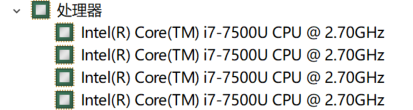

## 前言

基准测试（benchmark）是 go testing 库提供的，用来度量程序性能，算法优劣的利器。

在日常生活中，我们使用速度 m/s（单位时间内物体移动的距离）大小来衡量一辆跑车的性能，同理，我们可以使用”**单位时间内程序运行的次数**“来衡量程序的性能。

在日常开发中，如果和同事在代码实现上有分歧，不用多费口舌，跑个分就知道谁牛X。

注意：在进行基准测试时，硬件资源直接影响测试结果，为了保证测试结果的可重复性，需要尽可能地保证硬件资源一致。（单一变量原则）

## 快速开始

创建项目 ``learnGolang``

```shell
mkdir learnGolang
cd learnGolang
go mod init learnGolang
```

创建文件 ``main.go``，编写我们的被测函数

```go
package main

// 斐波那契数列
func fib(n int) int {
	if n < 2 {
		return n
	}
	return fib(n-1) + fib(n-2)
}

func sum(a, b int) int {
	return a + b
}
```

创建文件 ``main_test.go`` ，编写基准测试用例

```go
package main

import "testing"

func BenchmarkFib10(b *testing.B) {
	for n := 0; n < b.N; n++ {
		fib(10)
	}
}

func BenchmarkFib20(b *testing.B) {
	for n := 0; n < b.N; n++ {
		fib(20)
	}
}

func BenchmarkSum(b *testing.B) {
	for n := 0; n < b.N; n++ {
		sum(1, 2)
	}
}
```

- 位于同一个 ``package`` 内的测试文件以 ``_test.go`` 结尾，其中的测试用例格式为 ``func BenchmarkXxx(b *testing.B)`` ，注意 ``Xxx`` 首字母要大写（即驼峰命名法）
- 函数内被测函数循环执行 b.N 次

开始运行

```shell
$ go test -bench=. .
goos: windows
goarch: amd64
pkg: learnGolang
BenchmarkFib10-4         3360627               362 ns/op
BenchmarkFib20-4           26676             44453 ns/op
BenchmarkSum-4          1000000000               0.296 ns/op
PASS
ok      learnGolang     3.777s
```

- ``go test [packages]`` 指定测试范围

|                           | 方法一                      | 方法二            |
| ------------------------- | --------------------------- | ----------------- |
| 运行当前 package 内的用例 | go test packageName         | go test .         |
| 运行子 package 内的用例   | go test packageName/subName | go test ./subName |
| 递归运行所有的用例        | go test packageName/...     | go test ./...     |

- ``go test`` 命令默认不执行 benchmark 测试，需要加上 ``-bench`` 参数，该参数支持正则表达式，只有匹配到的测试用例才会执行，使用 ``.``  则运行所有测试用例

```shell
# 只运行斐波那契数列测试用例
$ go test -bench='.*Fib.*' .
goos: windows
goarch: amd64
pkg: learnGolang
BenchmarkFib10-4         3287449               357 ns/op
BenchmarkFib20-4           27097             44461 ns/op
PASS
ok      learnGolang     3.418s
```

- BenchmarkFib10-4 中的 4 即 `GOMAXPROCS`，默认等于 CPU 核数



- ``3287449	357 ns/op`` 表示单位时间内（默认是1s）被测函数运行了 3287449 次，每次运行耗时 357ns，

  3287449*357ns=1.173s（耗时比 1s 略多，因为测试用例执行、销毁等是需要时间的）

- ``ok learnGolang 3.418s`` 表示本次测试总耗时

## -benchtime t

在高中物理学中，由于测试物体瞬时速度不好实现，我们可以让物体多移动一段时间，然后采用“总距离/时间段”算出平均速度来代替瞬时速度。

go benchmark 默认测试时间是 1s，同样的原理，为了提升测试准确度，我们可以使用该参数适当增加时长。

```shell
➜  learnGolang go test -bench='Fib10$'              
goos: linux
goarch: amd64
pkg: learnGolang
BenchmarkFib10-12        4153650               288 ns/op
PASS
ok      learnGolang     1.491s
# 指定时长为 5s
➜  learnGolang go test -bench='Fib10$' -benchtime=5s
goos: linux
goarch: amd64
pkg: learnGolang
BenchmarkFib10-12       20616992               288 ns/op
PASS
ok      learnGolang     6.235s
```

还是高中物理学，我们也可以指定物理移动的距离，然后测量所耗费的时间，计算平均速度。

该参数还支持特殊的形式 ``Nx`` ，用来指定被测程序的运行次数。

```shell
# 指定运行次数为 1000 次
➜  learnGolang go test -bench='Fib10$' -benchtime=1000x
goos: linux
goarch: amd64
pkg: learnGolang
BenchmarkFib10-12           1000               305 ns/op
PASS
ok      learnGolang     0.002s
```

## -count n

同样类似与测量物体速度，为了提升精确度，我们多做几次测试。

```shell
➜  learnGolang go test -bench='Fib10$' -benchtime=5s -count=3 
goos: linux
goarch: amd64
pkg: learnGolang
BenchmarkFib10-12       19596388               288 ns/op
BenchmarkFib10-12       20796957               290 ns/op
BenchmarkFib10-12       20492478               291 ns/op
PASS
ok      learnGolang     18.542s
```

## -cpu n

该参数可以设置 benchmark 所使用的 CPU 核数。

下面我们模拟一次多核并行计算的例子，并观察设置不同核数后的测试结果

```go
// main.go
func parallelExam() int {
	chs := make([]chan int, 10) // 设置 10 个协程去并行计算
	for i := 0; i < len(chs); i++ {
		chs[i] = make(chan int, 1)
		go parallelSum(chs[i])
	}
	sum := 0
	for _, ch := range chs {
		res := <-ch
		sum += res
	}
	return sum
}

func parallelSum(ch chan int) {
	defer close(ch)
	sum := 0
	for i := 1; i <= 100000; i++ { // 10万
		sum += i
	}
	ch <- sum
}
```

```go
// main_test.go
func BenchmarkParallelExam(b *testing.B) {
	for n := 0; n < b.N; n++ {
		parallelExam()
	}
}
```

```shell
➜  learnGolang go test -bench='BenchmarkParallelExam' -cpu=1,4,6,10,12   
goos: linux
goarch: amd64
pkg: learnGolang
BenchmarkParallelExam               3154            366754 ns/op
BenchmarkParallelExam-4             9316            119747 ns/op
BenchmarkParallelExam-6            10000            107040 ns/op
BenchmarkParallelExam-10           10000            108144 ns/op
BenchmarkParallelExam-12            9891            110018 ns/op
PASS
ok      learnGolang     5.604s
```

从运行结果看出，随着 CPU 核数的增加，性能逐步提升，但是到一定阈值后，性能趋于稳定，此时再增加 CPU 核数，性能反而下降，因为 CPU 核心之间的切换也是需要成本的。

## -benchmem

除了速度，内存分配情况也是需要我们重点关注的指标。

go 语言中，``slice`` 有一个 ``cap`` 属性，合理的设置该值，可以减少内存分配次数，分配大小，提升程序性能。

```go
// main.go
func sliceNoCap() {
	s := make([]int, 0) // 未设置 cap 值
	for i := 0; i < 10000; i++ {
		s = append(s, i)
	}
}

func sliceWithCap() {
	s := make([]int, 0, 10000) // 预先设置 cap 值
	for i := 0; i < 10000; i++ {
		s = append(s, i)
	}
}
```

```go
// main_test.go
func BenchmarkSliceNoCap(b *testing.B) {
	for n := 0; n < b.N; n++ {
		sliceNoCap()
	}
}

func BenchmarkSliceWithCap(b *testing.B) {
	for n := 0; n < b.N; n++ {
		sliceWithCap()
	}
}
```

```shell
➜  learnGolang go test -bench='Cap$' -benchmem .
goos: linux
goarch: amd64
pkg: learnGolang
BenchmarkSliceNoCap-12             31318             38614 ns/op          386297 B/op         20 allocs/op
BenchmarkSliceWithCap-12          111764             10269 ns/op           81920 B/op          1 allocs/op
PASS
ok      learnGolang     2.858s
```

可以看到前者每次执行会分配 386297 字节的内存，约等于后者的 3.76 倍，每次执行会分配内存 20 次，是后者的 20 倍。

## ResetTimer

> If a benchmark needs some expensive setup before running, the timer may be reset

如果在整个 benchmark 执行前，需要一些耗时的准备工作，我们需要将这部分耗时忽略掉

```go
func BenchmarkFib(b *testing.B) {
	time.Sleep(3 * time.Second) // 模拟耗时的准备工作
	b.ResetTimer() // 重置计时器，忽略前面的准备时间
	for n := 0; n < b.N; n++ {
		fib(10)
	}
}
```

## StopTimer & StartTimer

> StopTimer stops timing a test. This can be used to pause the timer while performing complex initialization that you don't want to measure.

> StartTimer starts timing a test. This function is called automatically before a benchmark starts, but it can also be used to resume timing after a call to StopTimer.

如果在被测函数每次执行前，需要一些准备工作，我们可以使用 ``StopTimer`` 暂停计时，准备工作完成后，使用 ``StartTimer`` 继续计时。

```go
func BenchmarkFib(b *testing.B) {
	for n := 0; n < b.N; n++ {
		b.StopTimer()  // 暂停计时
		prepare()      // 每次函数执行前的准备工作
		b.StartTimer() // 继续计时

		funcUnderTest() // 被测函数
	}
}
```

## 参考

https://geektutu.com/post/hpg-benchmark.html

https://golang.org/pkg/testing/

https://golang.org/cmd/go/#hdr-Testing_flags

https://dave.cheney.net/high-performance-go-workshop/gophercon-2019.html