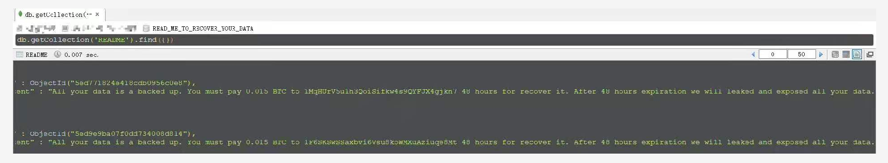
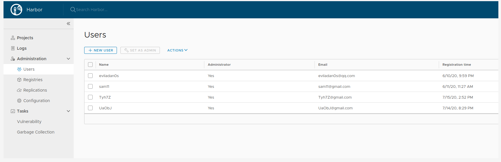

# 网络安全离我们并不远

## 前言

昨天晚上有朋友将公网上的一台 redis 密码设置为 123456，并且觉得没什么影响，再结合我之前毕业设计时被删库勒索，以及工作中碰到的网络安全相关的事情，就有了本篇感想，网络安全离我们并不远！

## 毕设 MongoDB 被删库

哪是答辩前的一天，我发现系统无法登录了，查看日志，报 error not found，连接数据库一看，好家伙，新闻报道中的勒索事件就发生在了我身上。

说实话，当时看到这个还有点小激动，甚至发了一条朋友圈（第一次碰到这种事，且由于数据不是很珍贵，跑一遍代码就重新生成了）

后台查看 mongo 的日志，发现不存在暴力破解密码的现象，黑客直接登录，然后一上来就是 drop（换句话说，即使我给了他 BTC，我的数据也不可能恢复）

我思来想去，终于想起来，我把配置文件提交到 Github 上了，里面的密码恰好是我 mongo 的密码，且有段时间仓库还是 public 的，不过奇怪的是，配置文件中用的是 ``mongodb://127.0.0.1:27017`` , 并不是我服务器的 IP，至于黑客是如何搞到服务器 IP 的，就不得而知了。

这儿要强调的是，**敏感数据不可提交到 Github 等公共仓库**，听搞安全的同事说，这世上不知道有多少台扫描器在 24h 监控着 Github 上的敏感数据。

## 摄像头直播

哪天是测试部的同事在测试**弱口令漏洞**，结果就发现了一台公网上的摄像头，用户名 root ，密码 admin123，然后我就登录了上去，看他们在厨房直播做饭。（是一家国外餐馆的摄像头）

还好是厨房，这要是家里的摄像头，隐私全没了。。。

## Harbor 任意管理员注册漏洞

由于业务需求，3月份的时候，我给我们部门部署了一个公网 harbor，当时开发任务又多又急，部署完测试能用后，就一直没有去管过它。(**用户注册功能也没关！！！**)

直到前几天排查 harbor redis 内存占用过高问题时，瞄了一眼用户管理，发现问题不简单，好几个奇怪的用户，部门群里问了大家，都说不知道。

后来一查，是 harbor 有漏洞，并且这个漏洞利用特别简单，就是在注册 payload 中添加 ``"has_admin_role":true`` 即可。[Harbor任意管理员注册漏洞复现||CVE-2019-1609](https://cloud.tencent.com/developer/article/1595234)

## 小结

本篇文章结合三件发生在我身上的网络安全事件，旨在提醒大家，网络安全离我们不远，希望大家能学习一些基本的安全常识，保护自身财产不受损失。

